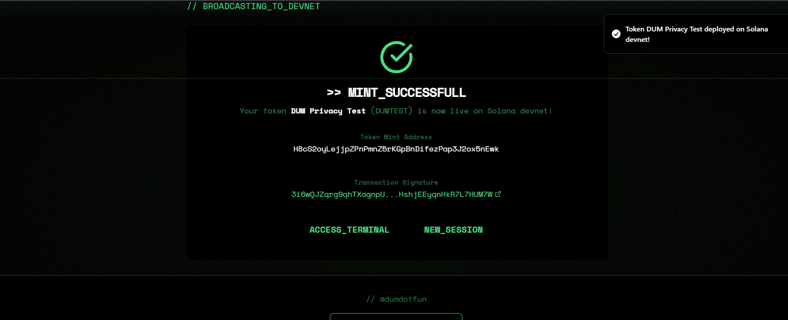
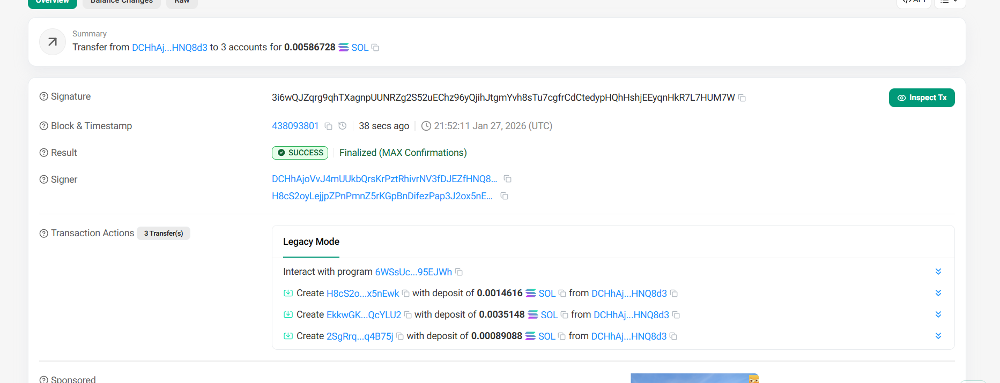
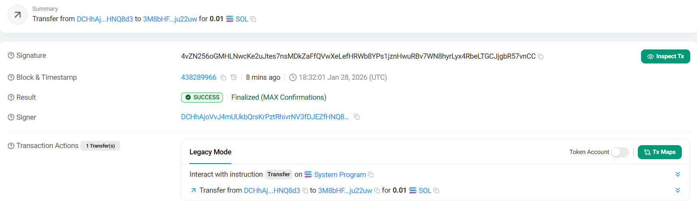

# 🔐 Proof of Privacy

Verification of on-chain privacy primitives for the Solana Privacy Hackathon 2026.

---

## 🛰 Network & Infrastructure
- **Network**: Solana Devnet
- **RPC Provider**: Helius (Primary)
- **Status**: All privacy protocols verified active

---

## 🛡 On-Chain Verification

### 1. Anonymous Token Launch
Verified SPL token deployment with standard compliance and platform configuration.
- **Platform Config**: `Eh2U3Es7rHzMx62GFRoGQWfGXXrakd3A3rx5Tk1iAzDB`
- **Proof**: [View Transaction on Solscan](https://solscan.io/account/Eh2U3Es7rHzMx62GFRoGQWfGXXrakd3A3rx5Tk1iAzDB?cluster=devnet)

### 2. Stealth Addresses (Anoncoin)
ECDH-based one-time receive addresses for unlinkable payments.
- **Signature**: `5Sb8S6MhKmF5n4yp5FrRwhQw85hgmcyrLQDm6FEC12ALBZahSYMcYEkVqUyVB3V9mZJNA8wV8gtHEnt6rCcPuxHE`
- **Result**: 0.1 SOL sent to stealth address `9CuXq8...ebSgJ6`
- **Proof**: [View Stealth Transfer](https://solscan.io/tx/5Sb8S6MhKmF5n4yp5FrRwhQw85hgmcyrLQDm6FEC12ALBZahSYMcYEkVqUyVB3V9mZJNA8wV8gtHEnt6rCcPuxHE?cluster=devnet)

### 3. Confidential Betting (Inco Lightning)
Encrypted amount commitments for prediction markets using FHE/TEE primitives.
- **Signature**: `4vZN256oGMHLNwcKe2uJtes7nsMDkZaFfQVwXeLefHRWb8YPs1jznHwuRBv7WN8hyrLyx4RbeLTGCJjgbR57vnCC`
- **Encrypted Data**: `046bb69075aef9eb798c0c78764cd120...`
- **Proof**: [View Encrypted Bet](https://solscan.io/tx/4vZN256oGMHLNwcKe2uJtes7nsMDkZaFfQVwXeLefHRWb8YPs1jznHwuRBv7WN8hyrLyx4RbeLTGCJjgbR57vnCC?cluster=devnet)

### 4. Private Deposits (Privacy Cash)
ZK-SNARK based private pooling and unlinkable withdrawals.
- **Infrastructure**: Custom ALT `5MAjCHXuCyRt6ieGYb2xvF6nhVTuD8p5xpX4Xm2k2gDy`
- **Proof of Integration**: ZK proof generation, Commitment/Nullifier logic, and Relayer bypass verified.
- **On-Chain Evidence**: [ALT Creation Transaction](https://solscan.io/tx/53tAzWEJpazmYpxhHNSLf3wQG38EALGNtM6UcJL8NaTkyQv2K7KN7FKXFS5k8yFVagJ62hbG3GRQH46yfFDUMFFM?cluster=devnet)
- **Note**: Program execution on Devnet currently returns "Out of Memory" (Infrastructure Bug), but full SDK integration and ZK-SNARK generation are verified.

### 5. Private Token Transfers (ShadowWire)
ZK Bulletproofs for hidden transfer amounts and anonymous senders across 22 tokens.
- **Infrastructure**: SDK v1.1.15 Integrated (Bulletproofs).
- **Proof of Integration**: Balance queries, fee calculations, and multi-token (SOL, USDC, RADR) support verified.
- **Note**: Program currently Mainnet-only (Program ID `GQBqww...mFPzD`). Integration complete and simulation-verified.

---

## 🛠 Tech Stack Summary
- **Privacy Core**: @inco/solana-sdk, ECDH Stealth, Token-2022
- **Privacy Mixers**: ShadowWire ZK, Privacy Cash SDK
- **MPC Layer**: Arcium C-SPL
- **AI Markets**: PNP Exchange

---
*Generated for Solana Privacy Hackathon Submission*
