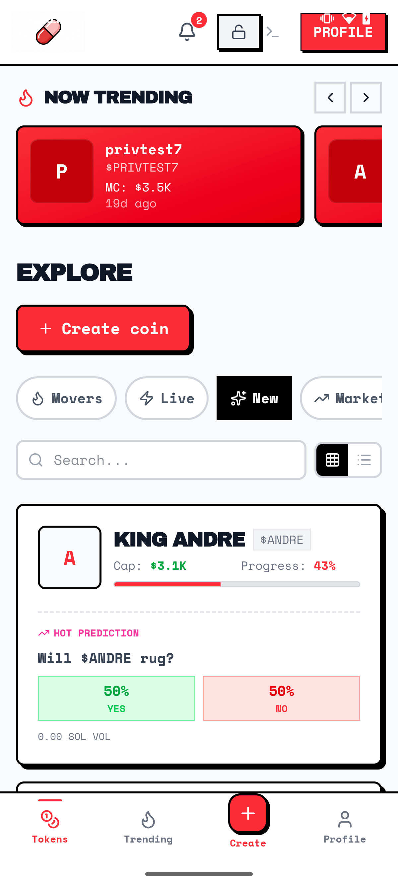
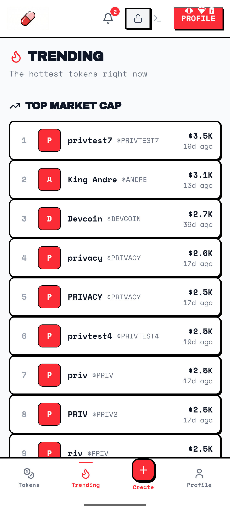
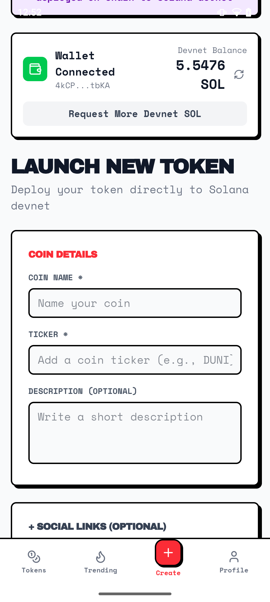

# dum.fun — Token Launchpad with Built-in Prediction Markets

> **Launch tokens. Trade on bonding curves. Bet if they'll rug.** — Built for [MONOLITH: Solana Mobile Hackathon](https://solanamobile.radiant.nexus/?panel=hackathon)

A mobile-first token launchpad with built-in prediction markets, built natively for the Solana dApp Store and Solana Seeker device. Create tokens, trade on bonding curves, and bet on outcomes — all with native on-device wallet signing.

---

## Demo & Deployment

- **Solana dApp Store**: Submitted for review ([App NFT](https://explorer.solana.com/address/DmthUk62U449R9CTP7x9udtZYZfyMcSgSFWaZTRFi2Ko))
- **Live Backend**: [dumfun.replit.app](https://dumfun.replit.app) *(Solana Devnet)*
- **APK**: Signed release build — `android/app/build/outputs/apk/release/app-release.apk`

---

## What It Does

**dum.fun** is a token launchpad with built-in prediction markets. Users can:

1. **Create tokens** — Deploy real SPL tokens on Solana devnet with one tap
2. **Trade on bonding curves** — Automated price discovery from 0 to 85 SOL market cap
3. **Create & bet on prediction markets** — Every token gets a default market, plus users can create their own from pre-defined templates
4. **Browse trending** — Leaderboards ranked by market cap, volume, and activity

All transactions are signed natively on-device using **Solana Mobile Wallet Adapter (MWA)** — no browser extensions, no QR codes, just tap and sign.

---

## Why Mobile-First

This app is designed specifically for the Solana Seeker and the dApp Store:

- **Native MWA v2** — `transact()` sessions with `signTransactions` for seamless on-device signing
- **Capacitor 8 hybrid app** — Web tech in a native Android shell, optimized for mobile viewport
- **Deep link support** — `https://dum.fun` links open directly in the app
- **Offline-resilient** — HTTP polling for transaction confirmations (WebSocket unreliable in WebView)
- **Touch-optimized UI** — Bottom navigation, large tap targets, swipe gestures

---

## Screenshots

| Home | Trending | Create Token | Trading |
|------|----------|-------------|---------|
|  |  |  |  |

---

## Architecture

```
┌─────────────────────────────────────────────────────┐
│              dum.fun Mobile App (Capacitor)          │
│                                                     │
│  ┌──────────────┐ ┌──────────────┐ ┌─────────────┐ │
│  │ Token Launch  │ │ Prediction   │ │ Trending    │ │
│  │ • Create      │ │ Markets      │ │ Leaderboard │ │
│  │ • Buy/Sell    │ │ • YES/NO bet │ │ • Top MCap  │ │
│  │ • Bonding     │ │ • Auto-resolve│ │ • Live      │ │
│  │   curve       │ │ • AI markets │ │   updates   │ │
│  └──────┬───────┘ └──────┬───────┘ └──────┬──────┘ │
│         └────────────────┼────────────────┘        │
│                          │                          │
│              Mobile Wallet Adapter (MWA v2)         │
│              signTransactions + sendRawTransaction   │
└──────────────────────────┬──────────────────────────┘
                           │
┌──────────────────────────▼──────────────────────────┐
│              Backend (Express + PostgreSQL)          │
│                                                     │
│  • Helius RPC for all Solana connections             │
│  • Real SPL token creation on devnet                 │
│  • Bonding curve price engine                        │
│  • Prediction market settlement                      │
│  • Rate limiting + wallet signature verification     │
└──────────────────────────┬──────────────────────────┘
                           │
┌──────────────────────────▼──────────────────────────┐
│              Solana Blockchain (Devnet)              │
│                                                     │
│  • SPL Token minting & transfers                     │
│  • Bonding curve program                             │
│  • Transaction confirmation via getSignatureStatuses │
└─────────────────────────────────────────────────────┘
```

---

## Key Features

### Token Launchpad
- One-tap SPL token creation with custom name, ticker, image, and social links
- Bonding curve trading (Buy/Sell) with real on-chain transactions
- Market cap tracking, progress bar to graduation (85 SOL)
- 1% platform trading fee

### Prediction Markets
- Every token automatically gets a default prediction market
- Users can create additional markets from pre-defined templates
- Binary YES/NO betting with SOL
- Auto-resolution engine checks expired markets every 5 minutes
- AI-powered market creation for custom questions

### Privacy Infrastructure
- ShadowWire bulletproof ZK transfers
- Stealth addresses for unlinkable receiving
- Privacy Cash deposits/withdrawals
- Confidential prediction betting via Inco Lightning

### Security Hardening
- Wallet signature verification on all sensitive endpoints
- Replay attack protection with signature deduplication
- Atomic SQL operations preventing TOCTOU race conditions
- Input validation, rate limiting, and admin auth on privileged routes

---

## Tech Stack

- **Mobile**: Capacitor 8.0.2 + Android (minSdk 23, targetSdk 35)
- **Frontend**: React 19 + TypeScript + Vite 7 + Tailwind CSS v4 + Shadcn/ui
- **Backend**: Express.js + PostgreSQL (Drizzle ORM) + WebSocket
- **Blockchain**: Solana Web3.js + Helius RPC + SPL Token SDK
- **Wallet**: Solana Mobile Wallet Adapter v2

---

## On-Chain Addresses

| Component | Address | Network |
|-----------|---------|---------|
| **Bonding Curve Program** | `6WSsUceUttSpcy8P5ofy5cYDG6pyYLWRz3XTnx95EJWh` | Devnet |
| **Platform Authority** | `G6Miqs4m2maHwj91YBCboEwY5NoasLVwL3woVXh2gXjM` | Devnet |
| **dApp Store App NFT** | `DmthUk62U449R9CTP7x9udtZYZfyMcSgSFWaZTRFi2Ko` | Mainnet |
| **dApp Store Release NFT** | `HXPiHurEsHPqPUHm5xu3XJhzZDt2reM4mgkMUSFSf3bA` | Mainnet |

---

## Getting Started

### Prerequisites
- Node.js 18+
- PostgreSQL database
- Helius API key ([free tier](https://helius.dev))
- Android Studio (for APK builds)

### Environment Variables

```bash
DATABASE_URL=postgresql://...
HELIUS_API_KEY=your-helius-api-key
SOLANA_NETWORK=devnet
FEE_RECIPIENT_WALLET=your-wallet-address
```

### Run Locally

```bash
npm install
npm run db:push
npm run dev
```

Open http://localhost:5000 and connect a Solana wallet (set to Devnet).

### Build Android APK

```bash
npx vite build
npx cap sync android
cd android && JAVA_HOME="/path/to/jdk" ./gradlew assembleRelease
```

APK output: `android/app/build/outputs/apk/release/app-release.apk`

---

## MONOLITH Hackathon

This project is submitted to the **MONOLITH Solana Mobile Hackathon** (Feb 2 — Mar 9, 2026), organized by Solana Mobile and Radiants.

- **Category**: DeFi / Tokens
- **Track**: Mobile-first app for the Solana dApp Store
- **Device**: Built and tested on Solana Seeker
- **Submission**: Published to dApp Store via CLI (`npx dapp-store publish submit`)

### Testing Instructions
1. Install the APK on a Solana Seeker or Saga device
2. Tap "Log In" to connect via Mobile Wallet Adapter
3. Request devnet SOL using "Request More Devnet SOL"
4. Create a token from the Create tab
5. Trade tokens using Buy/Sell on any token detail page
6. Place a prediction bet (YES/NO) on any token's market
7. Create a new prediction market from the token detail page
8. Browse trending tokens on the Trending tab

---

## License

MIT License — See [LICENSE](LICENSE) for details.

---

<div align="center">

**dum.fun** — Token Launchpad with Built-in Prediction Markets on Solana Mobile

Built for the [MONOLITH Solana Mobile Hackathon](https://solanamobile.radiant.nexus/?panel=hackathon)

</div>
